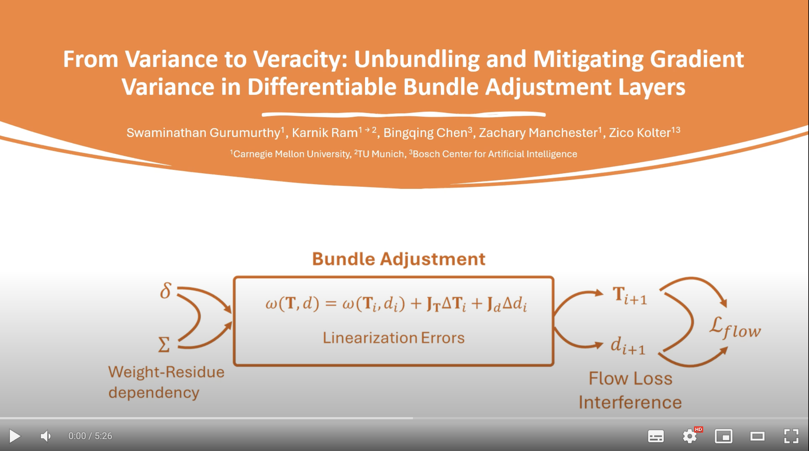

## Overview
[](https://www.youtube.com/watch?v=CTAcCmC0gYk)

## Installation and Evaluation
For installation and evaluation instructions please check README_DPVO.md, as the instructions are the same for both setups.

## Training

To train vanilla DPVO run the following command (log files will be written to `runs/<your name>`). 
```
python train.py --steps=240000 --lr=0.00008 --name=<your name> --so_flag
```
Model will be run on the validation split every 10k iterations.

To train the weighted version, run the following command

```
python train.py --steps=240000 --lr=0.0004 --name=<your name> --wtd_obj
```

To train the non-streaming version with 8 inner loop steps, run the following
```
python train.py --steps=240000 --lr=0.00008 --name=<your name> --so_flag --iters 8 --n_frames 8
```

To train the corresponding weighted version, run the following,
```
python train.py --steps=240000 --lr=0.00008 --name=<your name> --wtd_obj --iters 8 --n_frames 8
```
